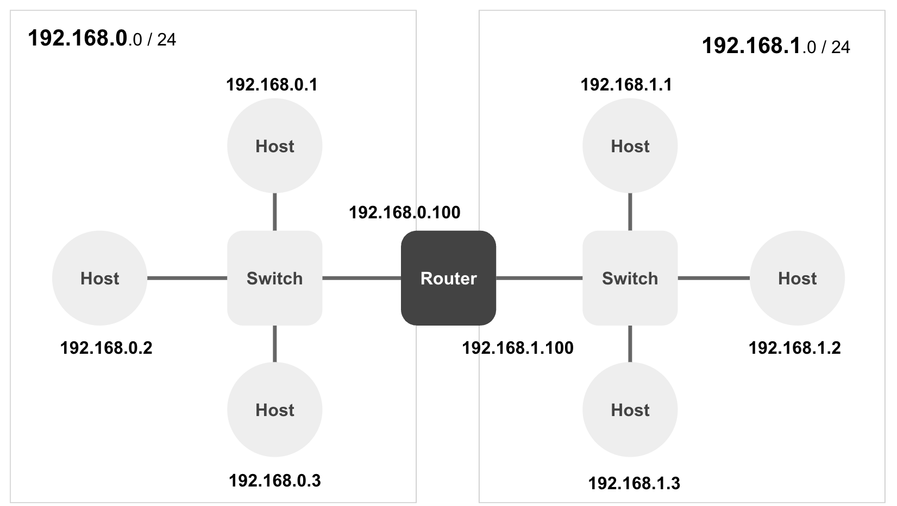
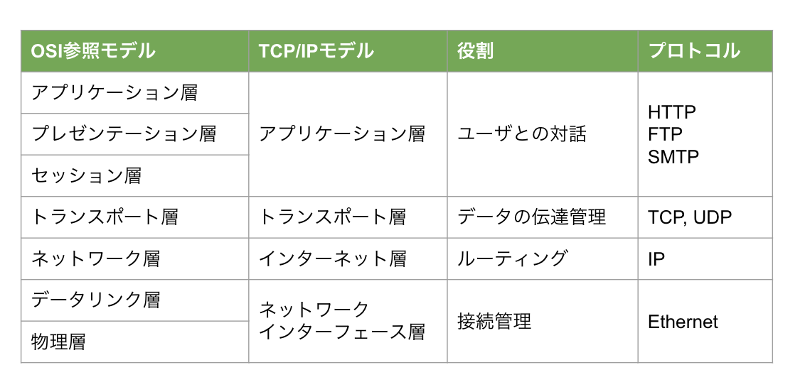
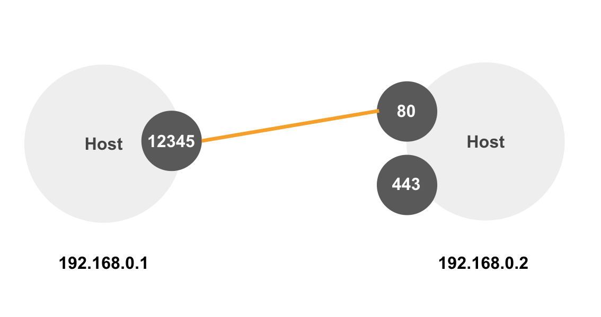
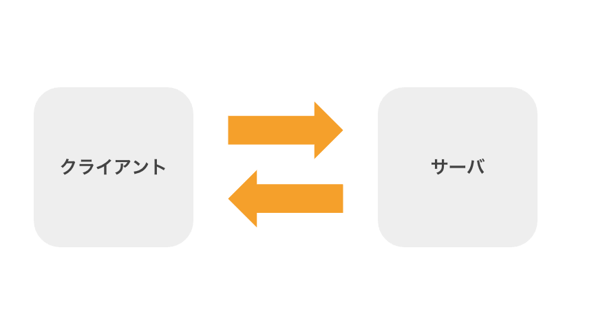

# インターネットの仕組み

## ネットワークとインターネットの違い

+ 狭義のネットワークとはコンピュータ同士を接続したもの
+ インターネットとは、ネットワーク同士を接続したもの
+ 広義のネットワークとは、上記の両方を含む

---

## URL

+ インターネット上の特定のリソースを特定し、その場所を示す文字列
+ 例
    + http://example.com:80/path?x=10&y=20#segment
+ URLは通常、以下の部分から構成されます：

|項目|例|用途|
|:--|:--|:--|
|スキーム|http://|リソースにアクセスするためのプロトコル|
|ドメイン|example.com|リソースが存在するサーバの名前|
|ポート番号|80|サーバ内のアクセス可能なアプリケーションを識別する番号|
|パス|/path|サーバ内の特定のリソース|
|クエリパラメータ|?x=10&y=20|リソースにアクセスするためのオプション情報|
|セグメント|#segment|リソース（ページ）内の部分指定|

---

## プロトコル

+ コンピュータや他のデバイスが通信するための規則または標準
+ データフォーマット、タイミング、エラーチェック、データ伝送の開始と終了など、データ通信のすべての側面が含まれる

### 代表的なプロトコル

+ HTTP
    + HTTPはブラウザとサーバー間でHTMLなどのウェブコンテンツを転送するためのプロトコル
    + HTTPはリクエストとレスポンスの形式で動作する
    + クライアント（通常はウェブブラウザ）がサーバーに対してリクエストを送信し、サーバーがレスポンスを返す
+ TCP（Transmission Control Protocol）
    + TCPはインターネットプロトコルスイートの主要なプロトコルの1つ
    + ネットワーク間の信頼性の高いバイトストリームを提供する
    + TCPはエラーチェックと再送機能を提供し、パケットが正しい順序で送受信されることを保証する
+ IP（Internet Protocol）
    + IPはインターネットプロトコルスイートの中核的なプロトコル
    + ネットワーク上でパケットを配送するためのメカニズムを提供する
    + IPアドレスを使って各デバイスを一意に識別し、パケットを送信元から送信先までルーティングする

### やや高度なプロトコル

+ SSH（Secure Shell）
    + ネットワーク上で安全なコマンドラインインターフェースへのアクセスを提供するためのプロトコル
    + 強力な暗号化を使用して、潜在的に安全でないネットワーク（例えば、インターネット）を通じてデータを安全に転送する
+ SCP（Secure Copy Protocol）
    + SSHプロトコルを使用してネットワーク上でファイルを安全に転送するためのプロトコル
    + SCPはデータの暗号化と認証を提供し、データの秘密性と完全性を保証する

---

## ネットワークの基礎知識

### OSI参照モデル

> 以下は詳細すぎるので割愛

+ アプリケーション層（Layer 7）
    + ネットワークアプリケーションとネットワーク自体の間のインターフェースを提供する
    + FTP、HTTP、SMTP、DNSなどのプロトコルがここで動作する
+ プレゼンテーション層（Layer 6）
    + データの形式と暗号化を扱う
    + 送信するデータがネットワークを通じて解釈可能な形式に変換（または復元）される
+ セッション層（Layer 5）
    + ネットワーク間の通信セッションの確立、管理、終了を扱う
+ トランスポート層（Layer 4）
    + データの分割と再構築、エラー検出と修正、データフローの制御を扱う
    + TCPやUDPプロトコルが動作する
+ ネットワーク層（Layer 3）
    + IPアドレスを使ってパケットの送受信とルーティングを扱う
    + ルーターやレイヤ3スイッチがこの層で動作する
+ データリンク層（Layer 2）
    + フレーム（パケットの物理的な表現）の送収信、物理アドレス（MACアドレス）の管理、エラー検出と修正を扱う
    + スイッチやブリッジなどのデバイスが動作する
+ 物理層（Layer 1）
    + ネットワークの基礎的なハードウェア部分を扱う
    + 無線LAN、ケーブル、ハブ、リピーター、ネットワークアダプター、および電気信号または光信号の形式などが含まれる

### TCP/IPモデル

+ アプリケーション層
    + ユーザーとの直接的な対話を管理する
    + FTP、HTTP、SMTP、DNSなどのプロトコル
    + OSIのセッション層、プレゼンテーション層、およびアプリケーション層に相当する
+ トランスポート層
    + エンドツーエンドのデータ伝送を管理する
    + TCP、UDPプロトコル
    + OSIのトランスポート層に相当する
+ インターネット層
    + IPアドレスとルーティングを含むパケットの転送を扱う
    + OSIのネットワーク層に相当する
+ ネットワークインターフェース層
    + ハードウェアデバイスとネットワークとの接続を管理する
    + OSIの物理層とデータリンク層に相当する

---

## TCP/IP

+ TCP/IPのように2つのプロトコルをあわせて利用することが一般的
+ TCPプロトコルは通信の信頼性を確保する
    + ポート番号を使って送受信するアプリケーションを決定する
+ IPプロトコルは通信経路を制御する
    + IPアドレスを使って送受信するホスト（コンピュータ）を決定する

---

## クライアント/サーバ

+ サービスの利用側をクライアント、サービスの提供側をサーバと呼ぶ
+ たとえばWebアプリケーションの文脈において
    + クライアントとは主にブラウザ（Chromeなど）を指す
    + サーバとはHTTPサーバ（Apacheなど）を指す

> 「サーバ」などIT用語は多義語が多いので文脈に合わせて理解することが大事です。

---

