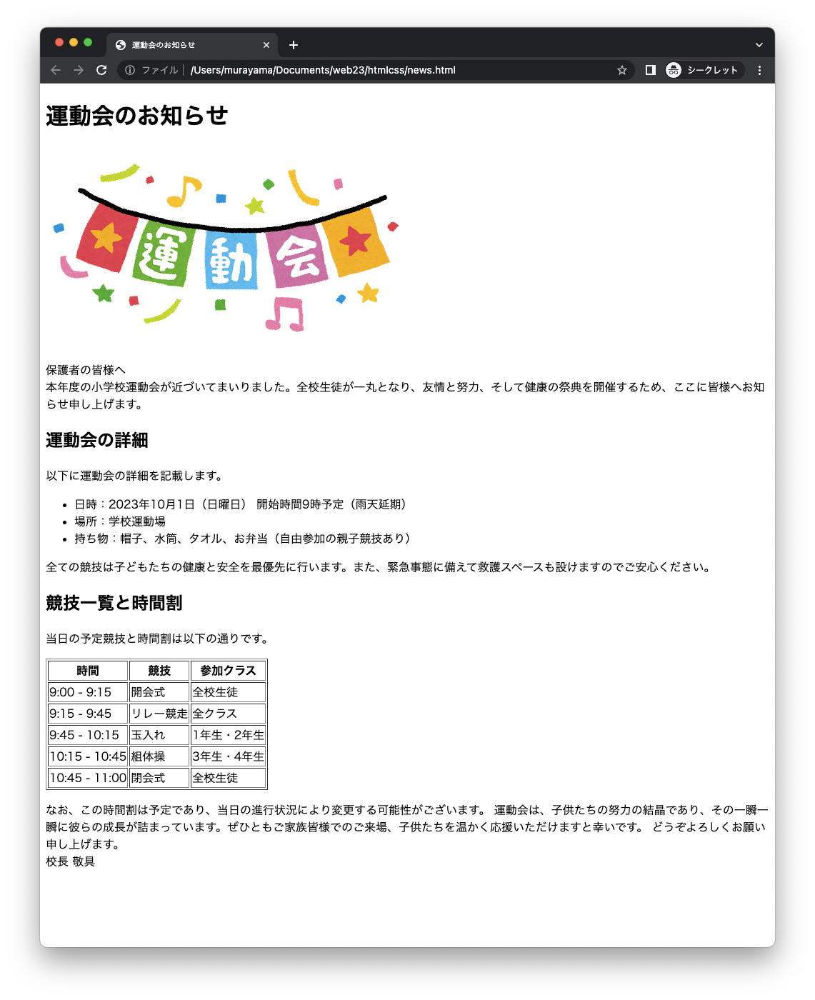

# HTML/CSSハンズオン

## ハンズオン - 1

1. エディタでhello.htmlファイルを作成する
2. ブラウザでhello.htmlファイルを表示する

### hello.html

```html
<!DOCTYPE html>
<html lang="ja">
  <head>
    <meta charset="UTF-8" />
    <title>Hello HTML</title>
  </head>
  <body>
    <h1>Hello HTML</h1>
  </body>
</html>
```

---

## ハンズオン - 2

1. エディタでhello.cssファイルを作成する
2. エディタでhello.htmlファイルを修正する
3. ブラウザでhello.htmlファイルを表示する

### hello.css

```css
h1 {
  color: red;
}
```

### hello.html

```html
<!DOCTYPE html>
<html lang="ja">
  <head>
    <meta charset="UTF-8" />
    <title>Hello HTML</title>
    <link rel="stylesheet" href="hello.css" />
  </head>
  <body>
    <h1>Hello HTML</h1>
  </body>
</html>
```

> `<link rel="stylesheet" href="hello.css" />` を追記します。

---

## ハンズオン-3

1. 以下のテキストを使って、エディタでnews.htmlファイルを作成する
2. ブラウザでnews.htmlファイルを表示する

```
運動会のお知らせ

保護者の皆様へ
本年度の小学校運動会が近づいてまいりました。全校生徒が一丸となり、友情と努力、そして健康の祭典を開催するため、ここに皆様へお知らせ申し上げます。

運動会の詳細
以下に運動会の詳細を記載します。
日時：2023年10月1日（日曜日） 開始時間9時予定（雨天延期）
場所：学校運動場
持ち物：帽子、水筒、タオル、お弁当（自由参加の親子競技あり）
全ての競技は子どもたちの健康と安全を最優先に行います。また、緊急事態に備えて救護スペースも設けますのでご安心ください。

競技一覧と時間割
当日の予定競技と時間割は以下の通りです2。

時間	競技	参加クラス
9:00 - 9:15	開会式	全校生徒
9:15 - 9:45	リレー競走	全クラス
9:45 - 10:15	玉入れ	1年生・2年生
10:15 - 10:45	組体操	3年生・4年生
10:45 - 11:00	閉会式	全校生徒
なお、この時間割は予定であり、当日の進行状況により変更する可能性がございます。 運動会は、子供たちの努力の結晶であり、その一瞬一瞬に彼らの成長が詰まっています。ぜひともご家族皆様でのご来場、子供たちを温かく応援いただけますと幸いです。 どうぞよろしくお願い申し上げます。
校長 敬具
```




### 画像素材

[undoukai.png](img/undoukai.png)

---

## ハンズオン-4

1. エディタでnews.cssファイルを作成する
2. エディタでnews.htmlファイルを修正する
3. ブラウザでnews.htmlファイルを表示する

> news.cssを使って画面のデザインを調整してください。


---

## ハンズオン-5

1. エディタでlogin.htmlファイルを作成する
2. ブラウザでlogin.htmlファイルを表示する

```html
<!DOCTYPE html>
<html lang="ja">
  <head>
    <meta charset="UTF-8" />
    <title>Login Page</title>
  </head>
  <body>
    <h1>Login Page</h1>
    <hr />
    <form action="login.php" method="post">
      <div>
        <label for="userId">USER ID</label>
        <input type="text" name="userId" id="userId" />
      </div>
      <div>
        <label for="userId">PASSWORD</label>
        <input type="password" name="password" id="password" />
      </div>
      <div>
        <input type="submit" value="login" />
      </div>
    </form>
    <a href="#">create a new account</a>
  </body>
</html>
```

---

## ハンズオン-6

1. エディタでlogin.htmlファイルを修正する
2. ブラウザでlogin.htmlファイルを表示する

```html
<!DOCTYPE html>
<html lang="ja">
  <head>
    <meta charset="UTF-8" />
    <title>Login Page</title>
    <link
      rel="stylesheet"
      href="https://cdn.jsdelivr.net/npm/water.css@2/out/water.css"
    />
  </head>
  <body>
    <h1>Login Page</h1>
    <hr />
    <form action="login.php" method="post">
      <div>
        <label for="userId">USER ID</label>
        <input type="text" name="userId" id="userId" />
      </div>
      <div>
        <label for="userId">PASSWORD</label>
        <input type="password" name="password" id="password" />
      </div>
      <div>
        <input type="submit" value="login" />
      </div>
    </form>
    <a href="#">create a new account</a>
  </body>
</html>
```

> `<link>` タグを追加します。

---


### おまけ：主要なHTMLタグ - ベスト10

+ ChatGPTに聞いてみました。

```
User
HTMLタグで利用頻度の高いもの、ベスト10を教えてください

ChatGPT
HTML（HyperText Markup Language）は、ウェブページの構造を定義するためのマークアップ言語です。HTMLはさまざまなタグを使用してコンテンツをマークアップし、その性質と意味をブラウザに伝えます。以下に一般的によく使われるHTMLタグのトップ10をリストします：

1. <!DOCTYPE html>：これは厳密にはタグではありませんが、すべてのHTMLドキュメントの先頭に配置され、そのドキュメントがHTML5で書かれていることをブラウザに伝えます。

2. <html>：HTMLドキュメントの全体を囲むルート要素です。

3. <head>：ページのメタデータ（タイトル、スタイルシートへのリンク、スクリプトなど）を含むコンテナ要素です。

4. <title>：ブラウザタブやブックマークの名前を提供するために<head>内部で使用される要素です。

5. <body>：HTMLドキュメントの主要部分（見えるコンテンツ）を囲む要素です。

6. <h1>から<h6>：異なるレベルの見出しを表す要素です。"<h1>"は最も重要で、"<h6>"が最も重要でない見出しを表します。

7. <p>：パラグラフ（段落）を表す要素です。

8. <a>：ハイパーリンクを作成する要素で、"href"属性とともに使用されます。

9. ：画像を埋め込む要素で、"src"（ソース）属性と"alt"（代替テキスト）属性を持つことが一般的です。

10. <div>：ページ内のセクションまたはコンテナを作成するための汎用的なブロックレベル要素です。

これらのタグは、ウェブページの構造とコンテンツを定義するための基本的な要素を提供します。ただし、実際のウェブページでは、これらに加えてさまざまな他のHTMLタグが使用されます。

User
11位〜20位もお願いします。

ChatGPT
続きとして、HTMLタグでよく使用されるものを11位から20位までリストします：

11. <span>：一般的にはインライン要素やテキストをグループ化し、特定のスタイルを適用するために使われます。

12. <ul> と <li>：順序なしリスト（箇条書きリスト）を作成するために使われます。リストの各項目は<li>（リストアイテム）タグでマークアップされます。

13. <ol> と <li>：順序付きリスト（番号付きリスト）を作成するために使われます。リストの各項目は<li>（リストアイテム）タグでマークアップされます。

14. <table>、<tr>、<td>、<th>：これらのタグはテーブルを作成するために使用されます。<table>はテーブル全体を、<tr>は行を、<td>はデータセルを、<th>はヘッダーセルを定義します。

15. <form>：ユーザーからのデータ入力を受け付けるフォームを定義します。この中には通常、<input>、<textarea>、button>などの要素が含まれます。

16. <input>：フォーム内の入力フィールドを作成するために使われます。このタグの"type"属性には様々な値（"text"、"password"、"checkbox"など）が設定できます。

17. <link>：外部リソース（通常はCSSスタイルシート）へのリンクをHTMLドキュメントの<head>部分に設定するために使用されます。

18. <script>：JavaScriptコードをHTMLドキュメントに組み込むために使われます。

19. <style>：HTMLドキュメント内で直接CSSスタイルを記述するために使われます。

20. <br>：改行（ブレーク）を挿入するためのタグで、特にテキストの中で改行を作成する場合に使われます。

これらのタグは、HTMLドキュメントの表示、構造、スタイリングなどを制御します。これらは最も一般的に使用されるものであり、特定の目的に合わせてさまざまな他のHTMLタグも使用できます。
```

---

### おまけ2

+ CSSのプロパティについても聞いてみました。

```
User
主要なCSSプロパティ、ベスト10を教えてください。

ChatGPT
以下に、Webデザインにおいて非常に一般的に使用されるCSSプロパティのベスト10を紹介します。ただし、このランキングは一部のプロパティについての一般的な使用頻度を基にしたもので、特定のプロジェクトや目的によっては異なるプロパティが重要になることがあります。

color: 要素の前景色（主にテキスト色）を指定します。

background-color: 要素の背景色を指定します。

font-size: フォントのサイズを指定します。

font-family: フォントの種類（フォントファミリー）を指定します。

margin: 要素の外側の余白（マージン）を指定します。

padding: 要素の内側の余白（パディング）を指定します。

border: 要素の周囲に線（ボーダー）を引くためのプロパティで、その色やスタイル、太さを指定します。

width / height: 要素の幅や高さを指定します。

display: 要素のボックスタイプを指定します。例えば、ブロックレベル要素にするか、インライン要素にするかなどを決定します。

position: 要素の配置方法を指定します。絶対配置、相対配置、固定配置などが選べます。

これらのプロパティは基本的なレイアウトやスタイリングを制御するのに非常に役立ちますが、CSSにはこれら以外にも多くのプロパティが存在します。プロジェクトの具体的な要件に基づいて適切なプロパティを選択することが重要です。
```

---

### おまけ3

+ 運動会の案内文の生成スクリプトです。

```
以下の要件に従って文章を生成してください
+ 小学校から運動会のお知らせの案内文章です。
+ 文章はA4用紙、1枚程度です。
+ 見出し（見出し1,見出し2）がある
+ 段落（文章）がある
+ 箇条書き（リスト）がある
+ 表（テーブル）がある
```

