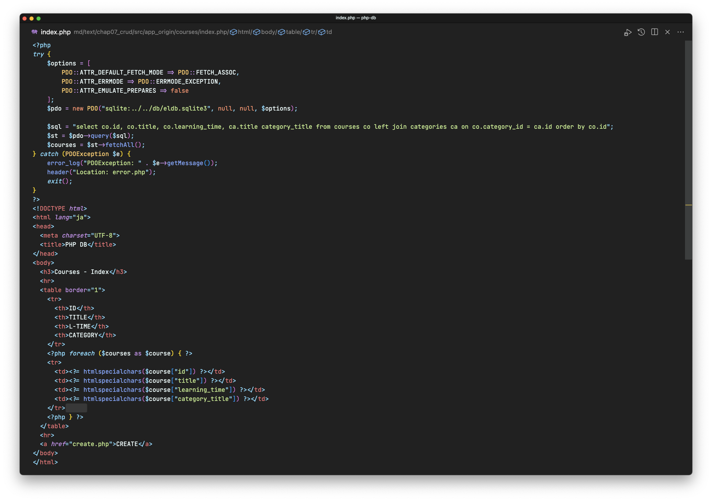
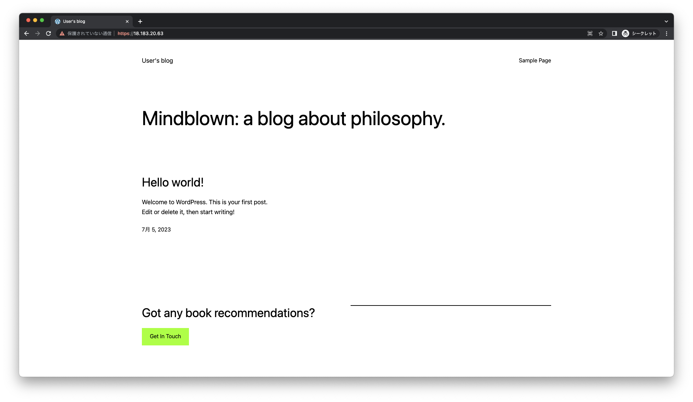
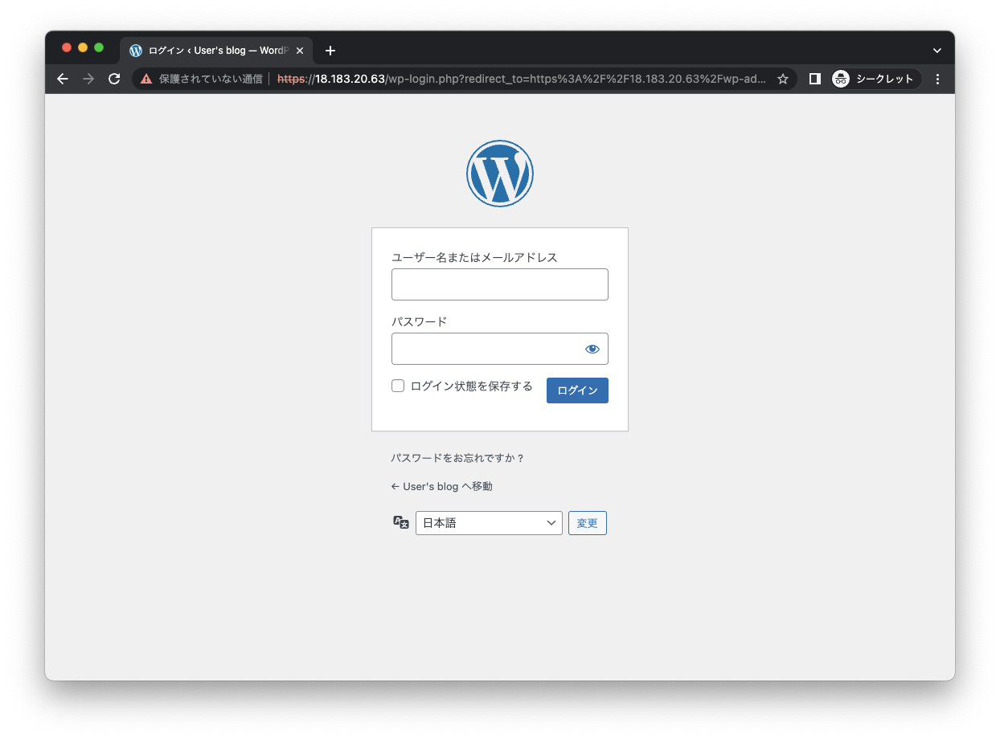
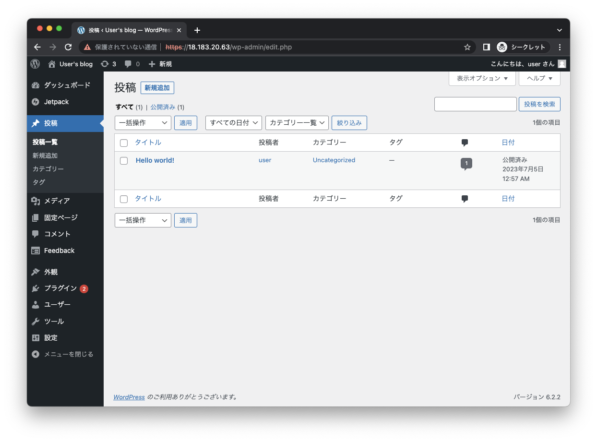

# PHP/WordPress

## PHP

+ PHP（PHP Hypertext Preprocessor）は、サーバーサイドのスクリプト言語の一つ
+ 1995年頃に開発された歴史のある言語
+ 現在もバージョンアップされており、8.2系がリリースされている

https://www.php.net/

### PHPの特徴

1. 埋め込み型のスクリプト言語
    + PHPはHTMLに直接埋め込むことが可能
    + 動的なウェブページを簡単に作成することができる
2. サーバーサイドスクリプト
    + サーバーサイドで動作するスクリプト言語
    + スクリプトはサーバー上で実行され、結果のHTMLがクライアント（ブラウザ）に送信される
3. データベース連携
    + 多くのデータベースシステムと連携できる
    + MySQL、PostgreSQL、SQLite、Oracleなど
4. コミュニティとライブラリ
    + PHPは大規模なコミュニティを持っており、広範なライブラリが存在する
    + 様々な課題に対して、ソリューションを簡単に見つけることができる
5. オープンソース
    + PHPはオープンソースのソフトウェア
    + 無料で利用できる

> PHPはWordPressを活用したWeb制作や、Webアプリケーションの開発に使用されています。

### PHPのはじめかた

+ 手元のパソコンにPHPをインストールする
+ Windowsの場合
    https://windows.php.net/download/
+ Macの場合
    https://www.php.net/manual/ja/install.macosx.packages.php

> PHPを直接インストールするかわりにXAMPPやMAMPといった統合開発パッケージを使用することもできます。

#### XAMPP

https://www.apachefriends.org/jp/index.html

#### MAMP

https://www.mamp.info/

---

## WordPress

+ WordPressは、オープンソースのコンテンツ管理システム（CMS）の一つ
+ 個人のブログから大規模なニュースサイトまで、さまざまな種類のウェブサイトを作成、管理するためのプラットフォーム
+ PHPで書かれており、データベースとしてはMySQLやMariaDBが使用される

https://ja.wordpress.org/

### WordPressの特徴

1. 使いやすさ
    + WordPressは非技術者でも簡単に使えるように設計されている
    + 直感的なインターフェースとリッチなエディタにより、記事の作成やメディアのアップロード、ページの設定などが簡単に行える

2. テーマとプラグイン
    + WordPressはカスタマイズ性が高く、多くのテーマとプラグインが提供されている
    + テーマはウェブサイトの見た目を変更し、プラグインは機能を追加または拡張する
    + いずれもWordPressの公式ディレクトリから自由にダウンロードできる（一部、有料のものあり）

3. SEO対策
    + WordPressはSEO（検索エンジン最適化）に優れている
    + その構造や設計が検索エンジンによって読み取りやすい形になっている
    + SEOをさらに強化するためのプラグインも多数存在する

4. コミュニティ
    + WordPressは世界中に大きなコミュニティがある
    + 課題に対する答えを見つけやすい
    + 新機能の追加や問題の解決が迅速に行われている

5. マルチユーザーと権限管理
    + WordPressは複数のユーザーをサポートする
    + それぞれのユーザーに対して異なる権限を割り当てることができる
    + これにより、チームでのコンテンツ作成やウェブサイト管理が可能となる

### WordPressのはじめかた

+ WordPressは大きく2通りの使い方がある
+ A. wordpress.orgからオープンソースのWordPressをダウンロードして使用する方法
+ B. wordpress.comでアカウントを作成して利用する方法

> Aの場合は、細かなカスタマイズが可能ですが、インターネット上にサーバを自分で準備する必要があります。

#### WordPressのログイン画面

#### WordPressの管理画面

